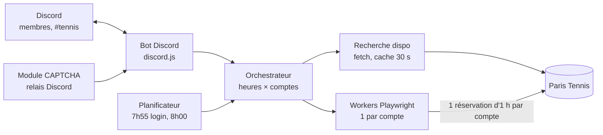

# Spécification – Bot de réservation Paris Tennis (Discord)

2 octobre 2026

## 1. Contexte, objectifs et périmètre

Le programme, nommé ici **TennisBot**, réserve automatiquement des courts sur Paris Tennis à l'ouverture des créneaux (8h00) et se pilote entièrement depuis un serveur Discord privé.

**Objectifs**

1. Réserver dès l'ouverture un créneau correspondant aux préférences (jour, heure, terrains préférés, type de court).
2. Gérer une liste ordonnée de **terrains préférés** par utilisateur ou par groupe.
3. Enchaîner **plusieurs heures consécutives** sur le même court en répartissant les réservations sur plusieurs comptes Paris Tennis (une réservation par compte et par jour).
4. Notifier dans Discord chaque étape : tentative, succès, échec, annulation possible.

**Hors périmètre (v1)** : paiement par carte bancaire (le bot utilise un carnet d'heures prépayé), interface web, revente ou échange de créneaux, réservation pour des personnes extérieures au groupe.

**Utilisateurs** : un petit groupe d'amis (2 à 8 joueurs), chacun titulaire de son propre compte Paris Tennis et membre du serveur Discord.

## 2. Fonctionnement de Paris Tennis et règles à respecter

Le bot doit être conçu autour de la règle « une réservation par compte et par jour », qui est précisément ce qui rend le multi-comptes nécessaire pour enchaîner deux heures ou plus.

| Règle | Valeur | Impact sur le bot |
| --- | --- | --- |
| Ouverture des créneaux | 7 jours à l'avance à 8h00 ([paris.fr](https://www.paris.fr/pages/les-tennis-2136)) ; les dépôts GitHub ciblent J+6 | Planificateur calé sur 8h00:00 heure de Paris ; décalage J+6/J+7 paramétrable et vérifié en dry-run |
| Quota | 1 réservation par jour et par compte ; on peut rejouer le même jour comme partenaire | Chaque heure consécutive = un compte différent |
| Horaires | Lun–sam 8h–22h, dim 8h–18h | Validation des demandes (pas de 22h, pas de dim. 18h) |
| Annulation | Gratuite jusqu'à 24 h avant, sinon facturée ([règlement](https://cdn.paris.fr/paris/2019/07/24/9195a6d8623f9a9f4cf61217c36e32a0.pdf)) | Rappel Discord à H-26 avec bouton « Annuler » |
| Absences | Compte bloqué après 5 réservations sans passage à l'accueil | Compteur d'absences par compte, alerte à partir de 3 |
| Invités | Identité des partenaires saisie à chaque réservation | Chaque compte a une liste de partenaires par défaut (max 3) |
| Paiement | Carnet d'heures prépayé correspondant au tarif et au type de court | Vérification du solde du carnet avant chaque tentative |
| Tarifs indicatifs | Couvert 20 € / 12 € réduit ; découvert 12 € / 7 € ([exemple Poliveau](https://www.paris.fr/lieux/tennis-poliveau-3664)) | Filtre `priceType` × `courtType` |

Un CAPTCHA a été ajouté au processus de réservation ; plusieurs projets ont cessé de fonctionner à cause de lui (voir section 3).

## 3. Analyse des dépôts GitHub existants et choix de méthode

Recommandation : reprendre l'approche de par-ici-tennis (navigateur headless, connexion anticipée puis attente de 8h00) pour la réservation, et l'appel AJAX de disponibilité de tennis-paris-watcher pour la recherche rapide.

| Dépôt | Stack | Ce qu'on reprend | Limites |
| --- | --- | --- | --- |
| [bertrandda/par-ici-tennis](https://github.com/bertrandda/par-ici-tennis) | Node.js, navigateur headless | Config `locations` (liste ordonnée ou objet `{site: [n° courts]}`), `hours` par préférence, `priceType`, `courtType`, `players` (3 max), mode dry-run, notifications ntfy + fichier .ics | Un seul compte ; pas d'interface de pilotage |
| [ericboucher/par-ici-tennis](https://github.com/ericboucher/par-ici-tennis) (fork) | Idem + GitHub Actions | Lancement à 7h40, login anticipé, attente active jusqu'à 8h00, alerte si le login finit après 8h00 ; option `day` (jour de semaine cible) | GitHub Actions peu précis à la minute |
| [wissam124/par-ici-tennis](https://github.com/wissam124/par-ici-tennis) (fork) | Idem | Validation des noms de sites contre l'annuaire officiel ; export du planning par court | — |
| [extremedevs/par-ici-tennis](https://github.com/extremedevs/par-ici-tennis) (fork) | AWS Lambda + EventBridge | Déclenchement à 7h59 | Infra lourde pour notre besoin |
| [cdugeai/tennis-paris-watcher](https://github.com/cdugeai/tennis-paris-watcher) | Node.js, `fetch` | POST `Portal.jsp?page=recherche&action=ajax_disponibilite_map` avec `hourRange`, `when`, `selCoating[]`, `selInOut[]` → GeoJSON filtré sur `available` ; dédoublonnage par `_nomSrtm` | Lecture seule, pas de réservation |
| [RolandVrignon/paris-tennis-tenibotty](https://github.com/RolandVrignon/paris-tennis-tenibotty) | Node.js + bot Telegram | Distinction « demande programmée » / « réservation existante », dry-run qui va jusqu'au paiement puis libère | Un compte |
| [clementlecorre/tennis-ripa](https://github.com/clementlecorre/tennis-ripa) | Bot Telegram autour de par-ici-tennis | Commandes `/add`, `/list`, `/now` : bon modèle pour Discord | Indiqué comme cassé depuis l'ajout du CAPTCHA |

**Choix retenu**

- **Recherche** : appel HTTP direct à l'endpoint AJAX de disponibilité (rapide, sans navigateur), utilisé pour la veille et l'aperçu `/dispo`.
- **Réservation** : Playwright (Chromium headless), une session navigateur par compte, connexion à 7h55, réservation à 8h00:00.
- **CAPTCHA** : module interchangeable ; par défaut, résolution humaine relayée dans Discord (image + saisie). Ne pas dépendre d'un contournement automatique (voir section 7).

## 4. Exigences fonctionnelles

Toute l'interaction passe par des commandes slash Discord dans un salon dédié (`#tennis`), avec des réponses éphémères pour tout ce qui touche aux comptes.

### 4.1 Commandes Discord

| Commande | Paramètres | Effet |
| --- | --- | --- |
| `/dispo` | `date`, `heure_debut`, `heure_fin`, `couvert?` | Liste les créneaux libres sur les terrains préférés (lecture seule) |
| `/reserver` | `date` ou `jour`, `heure`, `duree` (1–4 h), `terrains?`, `comptes?` | Crée une demande programmée ; exécutée à 8h00 le jour d'ouverture, ou immédiatement si le créneau est déjà ouvert |
| `/recurrent` | `jour`, `heure`, `duree`, `terrains?` | Demande hebdomadaire (ex. tous les mardis 19h–21h) |
| `/demandes` | — | Liste des demandes programmées, avec boutons « Modifier » / « Supprimer » |
| `/reservations` | `compte?` | Réservations confirmées sur Paris Tennis, tous comptes du groupe |
| `/annuler` | `reservation_id` | Annule sur Paris Tennis si plus de 24 h avant |
| `/terrains ajouter\|retirer\|ordonner\|liste` | `site`, `courts?`, `rang?` | Gère les terrains préférés |
| `/compte ajouter\|retirer\|statut` | via fenêtre modale | Enregistre un compte Paris Tennis (identifiants jamais affichés) |
| `/partenaires` | `compte`, `noms` | Partenaires par défaut déclarés à la réservation |
| `/dryrun` | comme `/reserver` | Simule tout le parcours sans confirmer |

### 4.2 Terrains préférés

- Un terrain préféré = un **site** (ex. « Suzanne Lenglen ») + éventuellement une liste de **numéros de courts**, comme le format objet de par-ici-tennis.
- Les préférences sont **ordonnées** (rang 1 = premier essayé) et existent à deux niveaux : liste du groupe (par défaut) et liste personnelle qui la remplace.
- Filtres optionnels par préférence : couvert / découvert, revêtement (`selCoating`), éclairé.
- Les noms de sites sont validés contre l'annuaire officiel au moment de l'ajout, avec autocomplétion Discord.

### 4.3 Multi-comptes et heures consécutives

- Le groupe déclare N comptes ; chaque compte est rattaché à un membre Discord qui en est le titulaire et qui joue effectivement.
- Une demande de durée *d* heures mobilise *d* comptes distincts, un par heure, sur le **même court** de préférence.
- Un compte déjà utilisé ce jour-là (réservation existante ou réservé ailleurs par le bot) est exclu automatiquement.
- L'utilisateur peut imposer les comptes (`comptes:`) ou laisser le bot choisir (rotation équitable, solde de carnet suffisant, compteur d'absences bas).
- Si le bloc complet n'est pas obtenu, la politique est configurable : **garder les heures obtenues** (défaut) ou **tout annuler** (tant que l'annulation est gratuite).

### 4.4 Notifications

- Message de résultat dans `#tennis` : site, court, heures, compte utilisé par heure, partenaires, fichier .ics joint.
- Mention du titulaire de chaque compte utilisé, pour qu'il sache qu'il doit se présenter à l'accueil.
- Rappel à H-26 (fin de l'annulation gratuite à H-24) avec bouton « Annuler ».

## 5. Architecture technique et modèle de données

Un seul processus Node.js (TypeScript) hébergé sur un petit VPS à Paris, horloge synchronisée par NTP, regroupe le bot Discord, le planificateur et les workers Playwright.



L'orchestrateur reçoit les demandes du bot et du planificateur, interroge la disponibilité, puis lance un worker par compte, donc une heure réservée par worker.

### 5.1 Composants

| Composant | Rôle | Techno proposée |
| --- | --- | --- |
| Bot Discord | Commandes slash, modales, boutons, messages de résultat | discord.js v14 |
| Planificateur | Déclenche les demandes à 7h55 (préchauffe) et 8h00:00 | node-cron + horloge NTP (chrony) |
| Moteur de recherche | Appels AJAX de disponibilité, cache 30 s | `fetch` natif |
| Orchestrateur | Calcule le plan d'affectation heures × comptes × courts, gère les échecs | Code maison |
| Workers de réservation | Un contexte navigateur isolé par compte, en parallèle | Playwright (Chromium) |
| Module CAPTCHA | Interface `solve(image) → texte` ; implémentation par défaut : relais Discord | Plugin |
| Coffre d'identifiants | Mots de passe chiffrés au repos | AES-256-GCM, clé en variable d'environnement |
| Stockage | Comptes, préférences, demandes, réservations, journal | SQLite (Prisma ou Drizzle) |

Alternative Python équivalente : discord.py + APScheduler + Playwright Python. Le choix Node.js permet de réutiliser directement le code de par-ici-tennis.

### 5.2 Modèle de données

| Table | Champs principaux |
| --- | --- |
| `account` | id, discord\_user\_id (titulaire), email, password\_enc, price\_type, carnet\_balance, no\_show\_count, active |
| `partner` | id, account\_id, nom, prénom (max 3 par compte) |
| `favorite_court` | id, scope (groupe / user\_id), site\_name, court\_numbers\[\], covered?, coating\[\], rank |
| `request` | id, created\_by, date ou weekday, start\_hour, duration\_h, court\_scope, forced\_accounts\[\], partial\_policy, status (scheduled / running / done / failed / cancelled), recurrence |
| `booking` | id, request\_id, account\_id, site, court\_no, date, hour, paris\_ref, status (confirmed / cancelled), ics |
| `attempt_log` | id, request\_id, account\_id, timestamp, step, result, latency\_ms, error |

### 5.3 Configuration (`config.yaml`)

```yaml
timezone: Europe/Paris
opening: { hour: "08:00:00", days_ahead: 6 }  # confirmé : vendredi 8h → jeudi suivant (J+6)
prewarm_minutes: 5
max_parallel_workers: 4
partial_policy: keep          # keep | rollback
captcha: { provider: discord_relay, timeout_s: 60 }
reminder_hours_before: 26
```

## 6. Algorithmes : recherche et réservation enchaînée

Le cœur du bot est un plan d'affectation qui donne à chaque heure du bloc un compte distinct et vise d'abord un même court pour toutes les heures.

### 6.1 Séquence à l'ouverture (J-6 ou J-7)

1. **7h55** : sélection des comptes, ouverture d'un contexte Playwright par compte, connexion, vérification du solde du carnet et de l'absence de réservation ce jour-là.
2. **7h59:30** : chaque worker se place sur la page de recherche du premier site préféré, formulaire prérempli.
3. **8h00:00** : un appel AJAX de disponibilité (une requête par plage horaire) donne la carte des courts libres.
4. Calcul du plan (6.2), puis lancement en parallèle d'un worker par heure.
5. Chaque worker : sélection du court et de l'heure → saisie des partenaires → CAPTCHA → paiement par carnet → récupération de la confirmation.
6. Consolidation : application de la politique de bloc partiel, message Discord, fichiers .ics.

### 6.2 Calcul du plan d'affectation

Entrées : heures demandées H = \[h1 … hd\], terrains préférés ordonnés P, comptes éligibles A (|A| ≥ d), disponibilités D.

1. Pour chaque court c de P dans l'ordre, si c est libre sur toutes les heures de H → plan = (h\_i, c, a\_i) avec a\_i les d premiers comptes de A. Fin.
2. Sinon, chercher deux courts **du même site** couvrant H (changement de court entre deux heures, sans changer de lieu).
3. Sinon, prendre le plus long sous-bloc consécutif disponible sur le meilleur court, puis compléter selon la politique `partial_policy`.
4. Ordre d'attribution des comptes : comptes imposés, puis solde de carnet le plus élevé, puis compteur d'absences le plus bas, puis rotation (le moins utilisé ces 30 derniers jours).

### 6.3 Gestion des échecs

- Créneau pris entre la recherche et la confirmation : le worker passe au court suivant **du même site** et prévient l'orchestrateur, qui réaligne les autres heures si possible.
- Erreur de connexion : 2 nouvelles tentatives à 2 s d'intervalle, puis le compte est remplacé par un compte de réserve.
- CAPTCHA non résolu dans le délai : l'heure est perdue, la réservation temporaire est libérée.
- Rien trouvé à 8h05 : passage en mode veille facultatif (requête de disponibilité toutes les 5 min jusqu'à J-1) pour profiter des annulations, comme le fait court\_booker.

### 6.4 Exemple

Demande : mardi 19h–21h (2 h), préférés = Lenglen courts 5/7, puis Poliveau. Comptes : Alice, Bob, Chloé.

| Heure | Court | Compte | Partenaires déclarés |
| --- | --- | --- | --- |
| 19h–20h | Suzanne Lenglen n°5 | Alice | Bob |
| 20h–21h | Suzanne Lenglen n°5 | Bob | Alice |

Chloé reste en réserve si l'une des deux tentatives échoue.

## 7. Sécurité, conformité et risques

Le principal risque n'est pas technique : c'est le blocage de comptes, que le bot doit éviter en respectant strictement les règles de Paris Tennis.

### 7.1 Règles d'usage imposées par le bot

- Un compte = une personne réelle, membre du serveur, qui a donné son accord et qui joue sur le créneau réservé à son nom. Pas de comptes créés pour l'occasion ni de prête-noms.
- Le titulaire est mentionné dans Discord à chaque réservation à son nom ; il peut désactiver son compte à tout moment (`/compte statut`).
- Le bot ne réserve jamais plus que ce que le groupe peut jouer : durée max 4 h par demande, une demande par jour et par groupe par défaut.
- Rythme de requêtes modéré : pas de boucle agressive à 8h00 (une recherche, puis les réservations ; veille à 5 min minimum).

### 7.2 Sécurité

- Identifiants saisis via modale Discord (jamais en clair dans un salon), chiffrés au repos, jamais journalisés.
- Rôle Discord `tennis-admin` requis pour gérer les comptes ; chaque titulaire ne voit et ne modifie que son compte.
- Sessions navigateur détruites après chaque exécution ; captures d'écran de débogage purgées après 7 jours.

### 7.3 Risques

| Risque | Probabilité | Impact | Parade |
| --- | --- | --- | --- |
| Changement du site (HTML, endpoints) | Élevée | Bot hors service | Sélecteurs centralisés, dry-run quotidien à 7h50 avec alerte Discord en cas d'échec |
| CAPTCHA plus strict | Élevée | Réservation impossible sans humain | Relais Discord par défaut ; un membre doit être disponible à 8h00 |
| Contournement automatique du CAPTCHA | — | Contraire à l'intention du site, risque de blocage | Hors périmètre de la v1 ; à décider en connaissance de cause |
| Blocage de compte (absences) | Moyenne | Compte perdu | Compteur d'absences, rappel H-26 avec annulation en un clic |
| Décalage d'horloge | Faible | Tentative trop tôt ou trop tard | NTP, alerte si dérive > 200 ms |
| Conditions d'utilisation de Paris Tennis | À vérifier | Sanctions sur les comptes | Lire les CGU avant mise en service ; usage personnel uniquement |

## 8. Plan de livraison et questions ouvertes

Quatre jalons, chacun utilisable seul, du simple outil de consultation jusqu'au bloc multi-comptes.

1. **v0.1 Consultation** : bot Discord + `/dispo` + `/terrains` (endpoint AJAX uniquement, aucun compte).
2. **v0.2 Réservation mono-compte** : `/compte`, `/reserver` d'une heure, `/dryrun`, relais CAPTCHA, notifications et .ics.
3. **v0.3 Multi-comptes** : orchestrateur, plan d'affectation, heures consécutives, politique de bloc partiel, `/reservations`, `/annuler`.
4. **v1.0 Confort** : `/recurrent`, veille des annulations, rappels H-26, compteur d'absences, dry-run quotidien de surveillance.

**Critères d'acceptation v1.0**

- [ ] Une demande 2 h sur un court préféré libre aboutit à 2 réservations consécutives sur le même court, avec 2 comptes différents, en moins de 60 s après 8h00.
- [ ] Aucun identifiant n'apparaît dans les logs ni dans Discord.
- [ ] Un échec partiel applique la politique configurée et l'explique dans Discord.
- [ ] Le dry-run parcourt tout le tunnel sans confirmer de réservation.

**Questions ouvertes**

- [x] Ouverture à J-6 ou J-7 ? **J+6** : le vendredi à 8h00 ouvre les créneaux du jeudi suivant.
- [ ] Nombre de comptes disponibles dans le groupe, et qui accepte d'être titulaire.
- [ ] Qui est disponible à 8h00 pour le relais CAPTCHA ?
- [x] Hébergement : **machine personnelle** dédiée, déploiement Docker Compose.
- [x] Langage : **Node.js** (TypeScript).

**Sources**

- [Paris Tennis – page officielle (paris.fr)](https://www.paris.fr/pages/les-tennis-2136)
- [Règles applicables à l'application Paris Tennis (PDF)](https://cdn.paris.fr/paris/2019/07/24/9195a6d8623f9a9f4cf61217c36e32a0.pdf)
- [Tennis Poliveau – horaires et tarifs](https://www.paris.fr/lieux/tennis-poliveau-3664)
- [bertrandda/par-ici-tennis](https://github.com/bertrandda/par-ici-tennis), [ericboucher/par-ici-tennis](https://github.com/ericboucher/par-ici-tennis), [wissam124/par-ici-tennis](https://github.com/wissam124/par-ici-tennis), [extremedevs/par-ici-tennis](https://github.com/extremedevs/par-ici-tennis)
- [cdugeai/tennis-paris-watcher](https://github.com/cdugeai/tennis-paris-watcher) et son [module d'API](https://raw.githubusercontent.com/cdugeai/tennis-paris-watcher/master/helpers/tennis-api-handler.js)
- [RolandVrignon/paris-tennis-tenibotty](https://github.com/RolandVrignon/paris-tennis-tenibotty), [clementlecorre/tennis-ripa](https://github.com/clementlecorre/tennis-ripa), [danroche10/court\_booker](https://github.com/danroche10/court_booker)
